# 东吴证券快速交易平台

本模块是对东吴证券快速交易平台接口（DTP）的python版本封装样例，如需在实际环境中使用，请自行保证测试的完整性，或参考本模块重新封装DTP接口。

有关DTP接口的详细信息，请参考《东吴证券快速交易平台接口使用说明书》。

## 模块结构

 


### DTP接口

通过ZeroMQ实现接口通信，代码实现为`DTP`类

#### 同步请求通道

使用ZeroMQ的REQ/REP通信模式，包含  

- 账号登录   
- 账号登出
- 委托查询
- 成交查询
- 资金查询
- 持仓查询 

#### 异步请求通道

采用ZeroMQ的DEALER/DEALER通信模式，包含

- 委托申报
- 批量委托申报
- 撤单申报 

#### 柜台状态回报通道

采用ZeroMQ的PUB/SUB通信模式，包含

- 委托回报
- 成交回报
- 撤单回报 

#### 风控违规回报通道

采用ZeroMQ的PUB/SUB通信模式。包含
- 风控回报

### Trader交易端

基于DTP通道封装交易接口，供策略端调用，代码实现为`Trader`类

### QuoteFeed行情端

基于DTP通道封装行情接口，供策略端调用，代码实现为`QuoteFeed`类

## 多线程

所有查询与报单请求在同一子线程中同步进行，主线程用于模块的启动与交易系统实时监控。

## API Reference

### fast_trader.dtp_trade.Trader.start

```python
fast_trader.Trader.start()
```

注册消息回调函数，启动zmq连接与交易端

### fast_trader.dtp_trade.Trader.add_strategy

```python
fast_trader.Trader.add_strategy(strategy)
```

- *strategy* (Strategy) - 用户策略实例

关联用户策略

### fast_trader.dtp_trade.Trader.login

```python
fast_trader.Trader.login(account, password)
```

登录

- *account* (str) - 账户
- *password* (str) - 密码

### fast_trader.dtp_trade.Trader.logout

登出

```python
fast_trader.Trader.logout(account)
```

### fast_trader.dtp_trade.Trader.send_order

发送委托

```python
fast_trader.Trader.send_order(
    order_original_id, exchange,
    code, price, quantity, order_side,
    order_type=dtp_type.ORDER_TYPE_LIMIT
)
```

- *order_original_id* (str) - 订单原始编号
- *exchange* (Enum) - 交易所代码

```protobuf
enum Exchange                             
{
    EXCHANGE_UNDEFINED   = 0;
    EXCHANGE_SH_A        = 1;               // 沪A
    EXCHANGE_SZ_A        = 2;               // 深A
}
```

- *code* (str) - 交易代码
- *price* (str) - 价格，最大允许包含两位小数
- *quantity* (int) - 委托股数
- *order_side* (Enum) - 委托竞价方向(买卖类型)

```protobuf
enum OrderSide
{
    ORDER_SIDE_UNDEFINED    = 0;
    ORDER_SIDE_BUY          = 1;            // 买入、新股申购
    ORDER_SIDE_SELL         = 2;            // 卖出
    ORDER_SIDE_CREATION     = 11;           // ETF申购
    ORDER_SIDE_REDEMPTON    = 12;           // ETF赎回
    ORDER_SIDE_REVERSE_REPO = 21;           // 质押式逆回购(国债逆回购)
    // ORDER_SIDE_CREDIT_BUY  = 31;            // 信用买入
    // ORDER_SIDE_CREDIT_SELL = 32;            // 信用卖出
}
```

- *order_type* (Enum) - 委托竞价类型

```protobuf
enum OrderType                              
{
    ORDER_TYPE_UNDEFINED    = 0;
    ORDER_TYPE_LIMIT        = 1;            // 限价
    // ORDER_TYPE_MARKET       = 2;         // 市价((沪市)最优五档即时成交剩余转限价/(深市)最优五档即时成交剩余撤单)
    // ORDER_TYPE_BEST_5_ONLY  = 3;         // 最优五档即时成交剩余撤单(上海/深圳)
    // ORDER_TYPE_BEST_5_LIMIT = 4;         // 最优五档即时成交剩余转限价(上海)
    // ORDER_TYPE_YOU_BEST     = 5;         // 对手方最优价格(最优一档)委托(深圳)
    // ORDER_TYPE_WE_BEST      = 6;         // 本方最优价格(最优一档)委托(深圳)
    // ORDER_TYPE_MARKET_ONCE  = 7;         // 即时成交剩余撤销委托(深圳)
    // ORDER_TYPE_MARKET_ALL   = 8;         // 全额成交或撤销委托(深圳)
}
```

### fast_trader.dtp_trade.Trader.send_order_batch

发送批量委托

```python
fast_trader.Trader.send_order_batch(orders)
```

- *orders* (list) - 每个元素即为`send_order`的参数字典

### fast_trader.dtp_trade.Trader.cancel_order

撤单

```python
fast_trader.Trader.cancel_order(exchange, order_exchange_id)
```

- *exchange* (Enum) - 交易所
- *order_exchange_id* (int) - 交易所报单编号

### fast_trader.dtp_trade.Trader.query_orders

查询订单，默认查询当日所有委托

```python
fast_trader.Trader.query_orders(**kw)
```

### fast_trader.dtp_trade.Trader.query_trades

查询成交，默认查询当日所有成交

```python
fast_trader.Trader.query_trades(**kw)
```

### fast_trader.dtp_trade.Trader.query_positions

查询成交，默认查询全部持仓

```python
fast_trader.Trader.query_positions(**kw)
```

### fast_trader.dtp_trade.Trader.query_capital

查询资金

```python
fast_trader.Trader.query_capital()
```

### fast_trader.dtp_trade.Trader.query_ration

查询配售权益

```python
fast_trader.Trader.query_ration()
```

### fast_trader.dtp_quote.QuoteFeed.start

启动行情接收

```python
fast_trader.dtp_quote.QuoteFeed.start()
```

### fast_trader.dtp_quote.QuoteFeed.subscribe

订阅行情

```python
fast_trader.dtp_quote.QuoteFeed.subscribe(code)
```

- *code* (str | list) - 证券代码或证券代码列表

### fast_trader.dtp_quote.QuoteFeed.subscribe_all

订阅全部行情

```python
fast_trader.dtp_quote.QuoteFeed.subscribe_all()
```

### fast_trader.dtp_quote.QuoteFeed.add_listener

添加消息消费者

```python
fast_trader.dtp_quote.QuoteFeed.add_listener(listener)
```

- *listener* (Any) - Dispatcher对象

### fast_trader.strategy.Strategy.start

启动策略

```python
fast_trader.strategy.Strategy.start()
```

### fast_trader.strategy.Strategy.on_start

策略启动回调，策略启动时触发。用户策略覆盖此方法，实现策略启动后的一系列操作

```python
fast_trader.strategy.Strategy.on_start()

### fast_trader.strategy.Strategy.set_dispatcher

设置dispatcher

```python
fast_trader.strategy.Strategy.set_dispatcher(dispatcher)
```

- *dispatcher* (Dispatcher) - 消息分发者Dispatcher实例

### fast_trader.strategy.Strategy.set_trader

设置trader

```python
fast_trader.strategy.Strategy.set_trader(trader)
```

- *trader* (Trader) - Trader实例

### fast_trader.strategy.Strategy.start_market

启动所有绑定的行情数据源

```python
fast_trader.strategy.Strategy.start_market()
```

### fast_trader.strategy.Strategy.add_datasource

绑定行情数据源

```python
fast_trader.strategy.Strategy.add_datasource(datasource)
```

- *datasource* (QuoteFeed) - 行情数据源

### fast_trader.strategy.Strategy.get_positions

获取持仓列表

```python
fast_trader.strategy.Strategy.get_positions()
```

返回值

- *positions* (list) - 持仓列表

### fast_trader.strategy.Strategy.get_orders

获取委托列表

```python
fast_trader.strategy.Strategy.get_orders()
```

返回值

- *orders* (list) - 委托列表

### fast_trader.strategy.Strategy.get_open_orders

获取未成交委托列表

```python
fast_trader.strategy.Strategy.get_open_orders()
```

返回值

- *open_orders* (list) - 未成交委托列表

### fast_trader.strategy.Strategy.get_trades

获取成交列表

```python
fast_trader.strategy.Strategy.get_trades()
```

返回值

- *trades* (list) - 成交列表

### fast_trader.strategy.Strategy.get_capital

查询账户权益

```python
fast_trader.strategy.Strategy.get_capital()
```

返回值

- *capital_detail* (dict) - 账户权益详情

### fast_trader.strategy.Strategy.on_market_trade

响应逐笔成交推送

```python
fast_trader.strategy.Strategy.on_market_trade(data)
```

- *data* (Message) - 逐笔成交数据

### fast_trader.strategy.Strategy.on_market_snapshot

响应行情快照推送

```python
fast_trader.strategy.Strategy.on_market_snapshot(data)
```

- *data* (Message) - 行情快照数据

### fast_trader.strategy.Strategy.on_market_order

响应逐笔委托推送

```python
fast_trader.strategy.Strategy.on_market_order(data)
```

- *data* (Message) - 逐笔委托数据

### fast_trader.strategy.Strategy.on_market_queue

响应委托队列推送

```python
fast_trader.strategy.Strategy.on_market_queue(data)
```

- *data* (Message) - 委托队列数据

### fast_trader.strategy.Strategy.on_market_index

响应指数行情推送

```python
fast_trader.strategy.Strategy.on_market_index(data)
```

- *data* (Message) - 指数行情数据

### fast_trader.strategy.Strategy.on_order

报单回报

```python
fast_trader.strategy.Strategy.on_order(data)
```

- *data* (Message) - 报单回报数据

### fast_trader.strategy.Strategy.on_trade

成交回报

```python
fast_trader.strategy.Strategy.on_trade(data)
```

- *data* (Message) - 成交回报数据

### fast_trader.strategy.Strategy.on_batch_order_submission

批量委托提交确认

```python
fast_trader.strategy.Strategy.on_batch_order_submission(data)
```

- *data* (Message) - 批量委托提交确认消息

### fast_trader.strategy.Strategy.on_order_cancelation

撤单回报

```python
fast_trader.strategy.Strategy.on_order_cancelation(data)
```

- *data* (Message) - 撤单回报数据

### fast_trader.strategy.Strategy.on_order_cancelation_submission

撤单委托提交确认

```python
fast_trader.strategy.Strategy.on_order_cancelation_submission(data)
```

- *data* (Message) - 撤单委托提交确认消息

### fast_trader.strategy.Strategy.on_compliance_report

风控消息推送

```python
fast_trader.strategy.Strategy.on_compliance_report(data)
```

- *data* (Message) - 风控消息

### fast_trader.strategy.Strategy.buy

买入委托

```python
fast_trader.strategy.Strategy.buy(code, price, quantity)
```

- *code* (str) - 证券交易代码
- *price* (float) - 价格，最多允许两位小数
- *quantity* (int) - 股票数量

### fast_trader.strategy.Strategy.sell

卖出委托

```python
fast_trader.strategy.Strategy.sell(code, price, quantity)
```

- *code* (str) - 证券交易代码
- *price* (float) - 价格，最多允许两位小数
- *quantity* (int) - 股票数量

### fast_trader.strategy.Strategy.buy_many

批量买入委托

```python
fast_trader.strategy.Strategy.buy_many(orders)
```

- *orders* (list) - 批量委托参数列表，每个元素即为买入委托的参数字典

### fast_trader.strategy.Strategy.sell_many

批量卖出委托

```python
fast_trader.strategy.Strategy.sell_many(orders)
```

- *orders* (list) - 批量委托参数列表，每个元素即为买入委托的参数字典

### fast_trader.strategy.Strategy.cancel_order

撤单委托

```python
fast_trader.strategy.Strategy.cancel_order(exchange, order_exchange_id)
```

- *exchange* (Enum) - 交易所代码
- *order_exchange_id* (int) - 交易所报单编号

### fast_trader.strategy.get_strategy_instance

返回用户策略实例

```python
fast_trader.strategy.strategy.get_strategy_instance(UserStrategy)
```

- *UserStrategy* (class) 用户策略类

返回值

- *strategy* (Strategy) - 用户策略实例